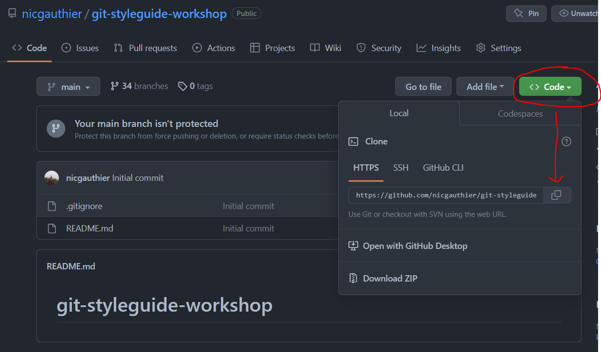
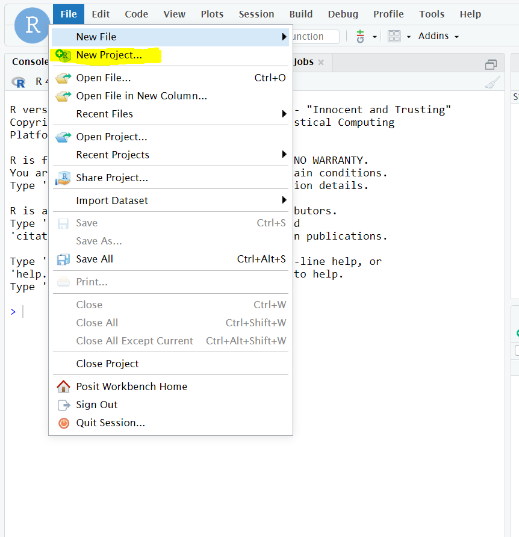
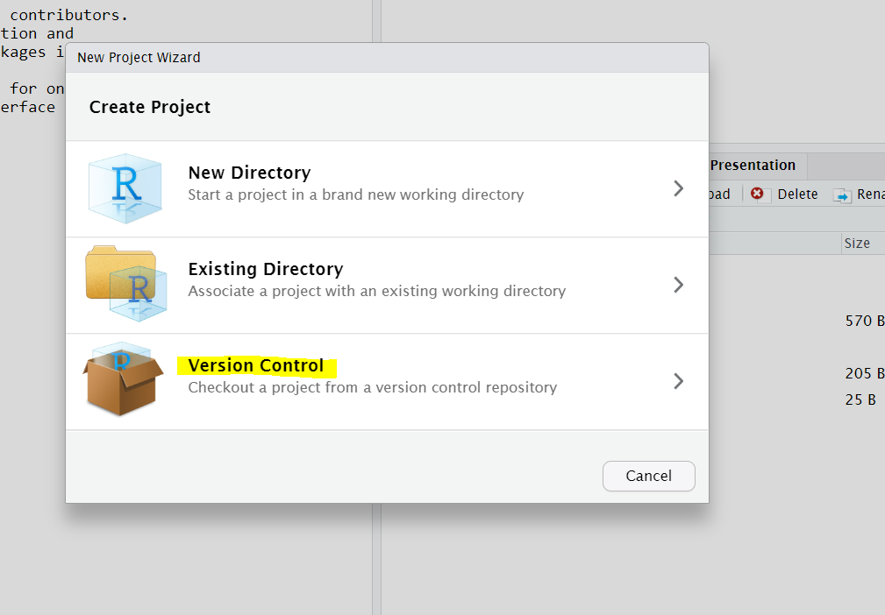
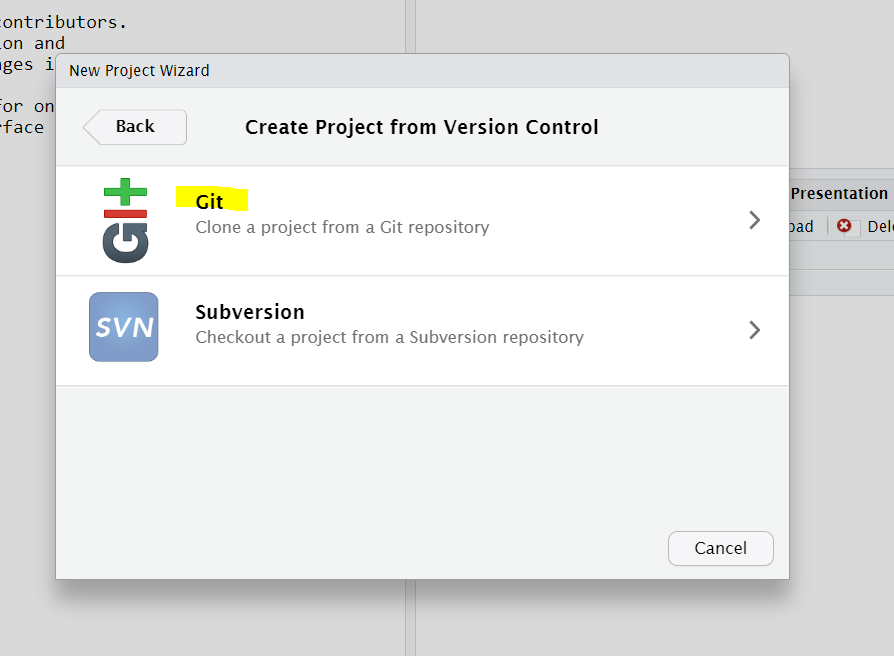
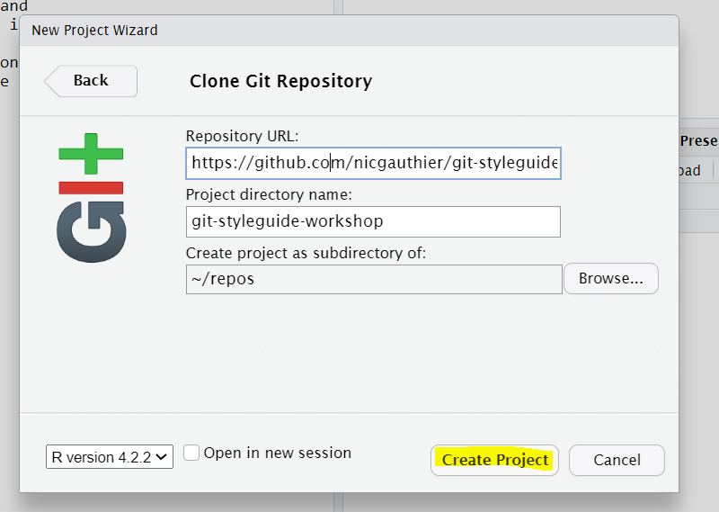
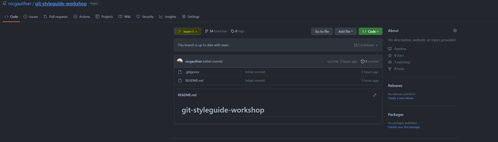
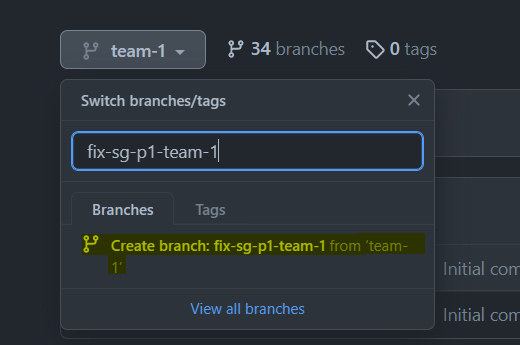
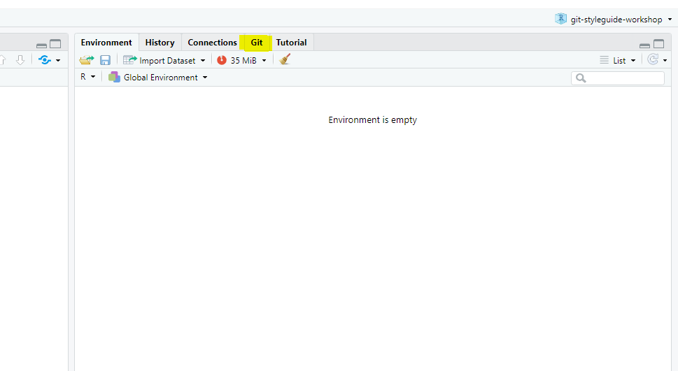
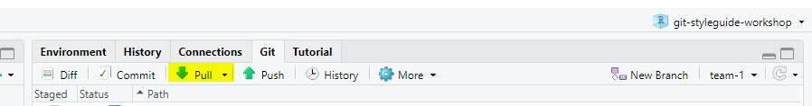
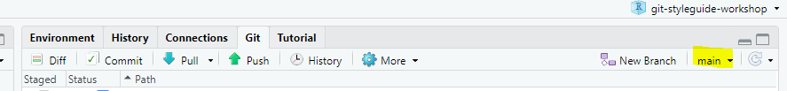

# git-styleguide-workshop

## 1. Si vous n'avez pas déjà cloné le repo, clonez ce repo et créer un projet dans Rstudio

## 2. Si vous avez déjà cloné le repo et que c'est à votre tour de jouer, créer une branche de développement à partir de la branche assignée à votre équipe.

### ATTENTION : le nom de votre branche ne doit pas être le même qu'une branche qui existe déjà, vous devez donc vous assurer d'avoir un nom unique mais qui indique tout de même de facon claire les changements que vous allez faire!

## 3. "pullez"" pour obtenir les changements les plus récents ainsi que la nouvelle branche de developpement que vous venez de créer

## 4. Assurez vous d'être dans la branche que vous venez de créer

## 5. Ouvrez le fichier de code avec des erreurs de style guide le plus récemment ajouté et corrigez les erreurs de styleguide

### NB : On ne s'attend pas à ce que le code roule , la majorité du code dans les fichiers faits références à des objets qui ne sont pas présents dans votre environnement. On s'intéresse uniquement à la syntaxe

## 6. Lorsque vous pensez avoir corrigé les erreurs de styleguide