# git-styleguide-workshop

## 1. Si vous n'avez pas déjà cloné le repo, clonez ce repo et créer un projet dans Rstudio

## 2. Si vous avez déjà cloné le repo et que c'est à votre tour de jouer, créer une branche de développement à partir de la branche assignée à votre équipe.

### ATTENTION : le nom de votre branche ne doit pas être le même qu'une branche qui existe déjà, vous devez donc vous assurer d'avoir un nom unique mais qui indique tout de même de facon claire les changements que vous allez faire!

## 3. "pullez"" pour obtenir les changements les plus récents ainsi que la nouvelle branche de developpement que vous venez de créer

## 4. Assurez vous d'être dans la branche que vous venez de créer

## 5. Ouvrez le fichier de code avec des erreurs de style guide le plus récemment ajouté et corrigez les erreurs de styleguide

### NB : On ne s'attend pas à ce que le code roule , la majorité du code dans les fichiers faits références à des objets qui ne sont pas présents dans votre environnement. On s'intéresse uniquement à la syntaxe

## 6. Lorsque vous pensez avoir corrigé les erreurs de styleguide, "commitez" et "pushez" vos modifications

### Assurez vous de sauvegarder votre fichier

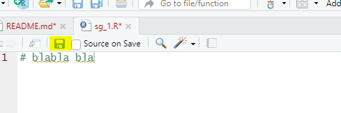

### Cochez le fichier que vous voulez "commiter"

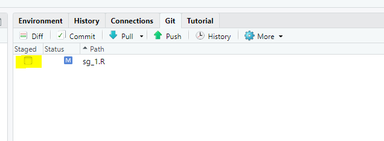

### Ouvrez la fenêtre de "Commit"

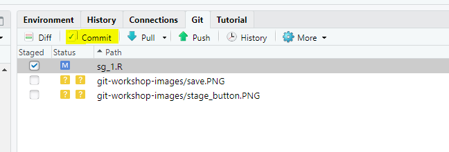

### Ajoutez une description brève mais claire des changements que vous venez de faire

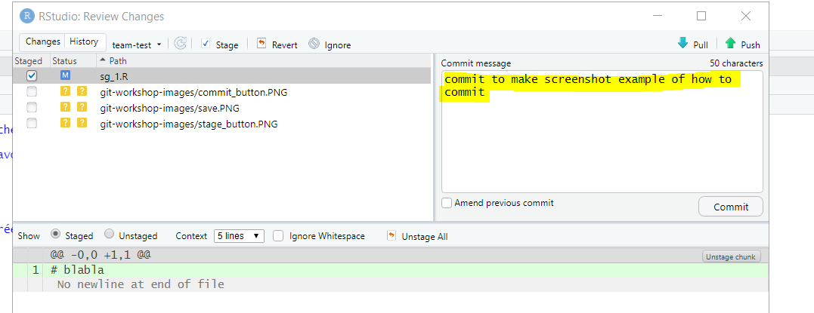

### Appuyez sur commit

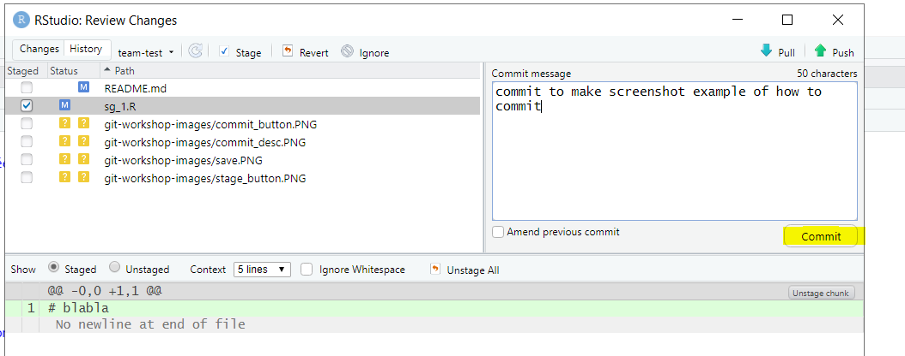

### "Pushez"

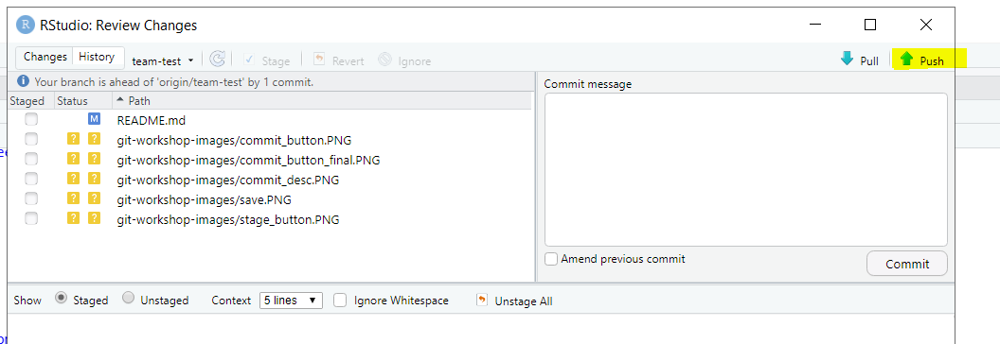

# 7. Vous voulez maintenant créer une pull request pour merger les changements que vous venez de faire dans la branche assignée à votre équipe

### Dans Github cliquer sur l'onglet de pull request

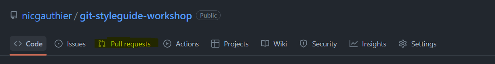

### Selectionnez la branche dans laquelle vous voulez "merger" vos changements, soit là branche assignée à votre équipe

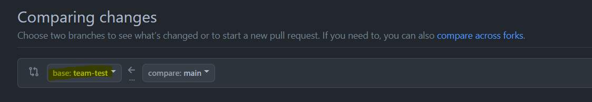

### Selectionnez la branche que vous voulez "merger"

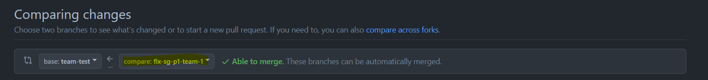

### Assurez vous que les changements correspondent bien à ce que vous avez fait et créer votre pull request

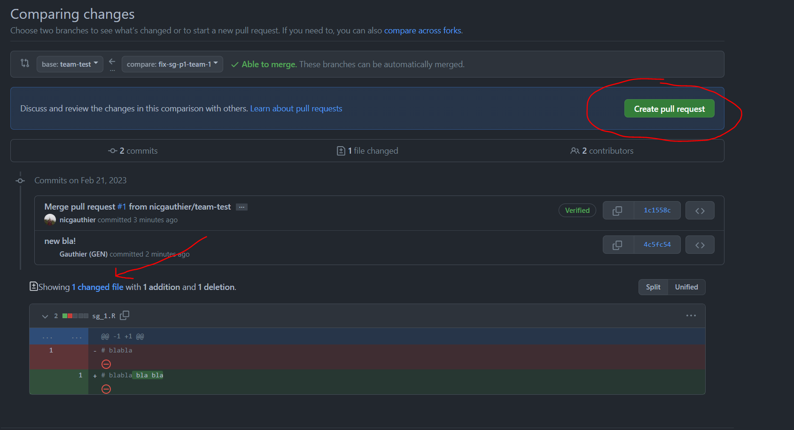

### Ajoutez votre arbitre comme reviewer de votre pull request et créez la pull request

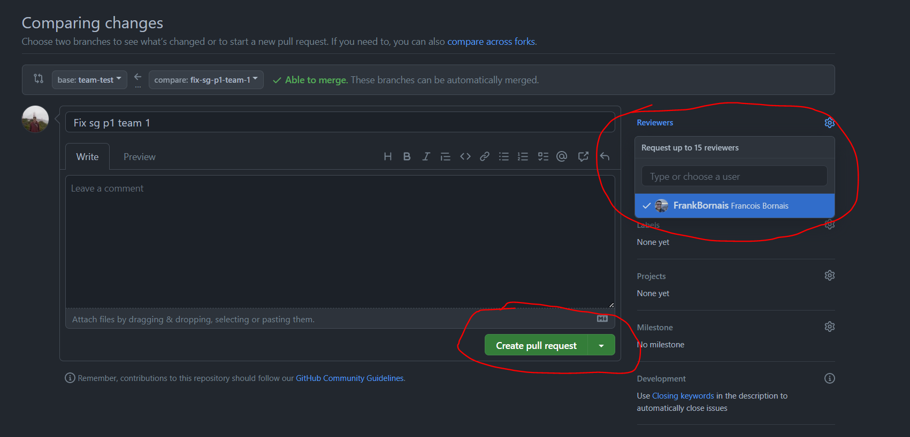

# 8. Si votre arbitre approuve votre pull request c'est que vous avez correctement corrigé les erreurs de styleguide!

### Si ce n'est pas le cas, votre arbitre ajoutera des demandes de changements à certaines lignes du fichier pour vous orientez dans vos recherches.
### Si vous ne trouvez vraiment pas, en dernier recours l'arbitre est autorisé à vous donner des indices pour vous permettre de progresser.

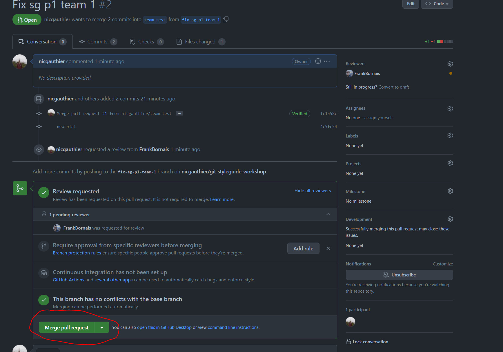

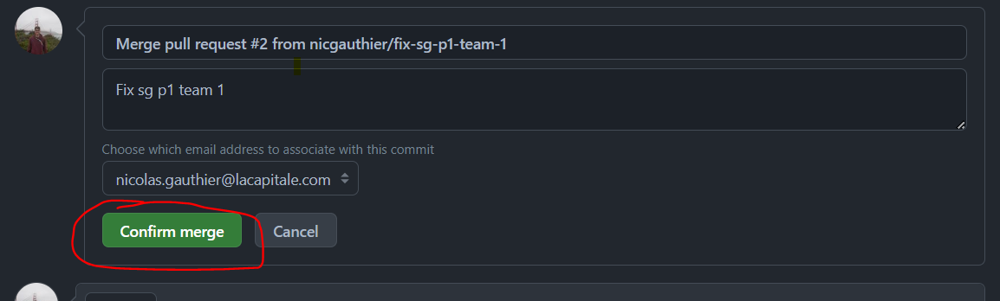

