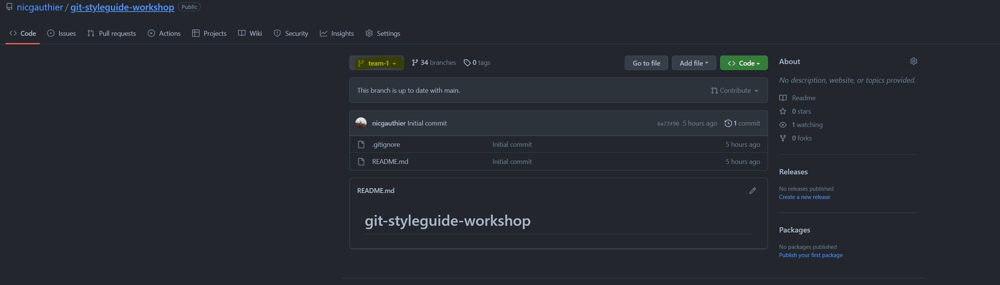

# git-styleguide-workshop

Bienvenue au workshop sur les bases de git et du style guide R!

Continuez à lire ce document pour obtenir les instructions

## Équipe

Si ce n'est pas déjà fait regroupez vous avec les gens qui sont dans votre équipe. Le workshop se fait en équipe et tout au long de l'atelier la collaboration est permise et même encouragé!

## Arbitre

Un ambassadeur est présent dans chaque équipe pour jouer le rôle d'arbitre. Son rôle est de s'assurer que vous êtes en mesure de progresser dans le jeu tout en respectant les règles du jeu.

PS : si vous êtes un arbitre, les instructions sur comment jouer votre rôle son décrit dans le README de la branche "ref" de ce repo

## Objectif

Le but de l'atelier est de compléter une image qui est créee à partir de charactères ASCII. Pour y arriver, vous devrez corriger la syntaxe de segments de code R qui ne respecte pas le style guide (voir la prochaine section pour plus de détails sur le ce qu'est le style guide). Vous devrez utiliser des commandes de base git pour progresser dans votre quête! La première équipe qui complètera son image sera déclaré gagnante, il n'a donc pas de temps à perdre!

## Style guide

Un style guide et simplement un guide de règle pour s'assurer que les choix syntaxiques d'un programmeur sont cohérents avec les choix syntaxiques de ses pairs. Le but est de facilité la lecture et la compréhension du code indépendament de l'auteur.

Le style guide qui a été adopté chez beneva est décrit dans le repo suivant [styleguide](https://github.com/LaCapitale/cgen-actu-coding)

**conseil** : gardez un onglet ouvert avec le style guide car il vous sera pratique durant l'atelier!

## Première étape du jeu

Déterminer un ordre pour déterminer la séquence dans laquelle chaque joueur s'executera.

Une fois l'ordre déterminé, le premier joueur peux débuter en suivant les instructions qui se retrouve dans le README de la branche au nom de votre équipe. Le branche assignée à votre équipe se nomme "team_x" où x est le numéro de votre équipe.

Pour selectionner la branche assignée à votre équipe. Vous pouvez soit la choisir dans la liste déroulante ou encore écrire le nom de la branche pour ensuite la selectionner. Si vous ne voyez pas votre branche dans la liste de branche appuyer sur "View all branches" tout au bas de la liste déroulante

