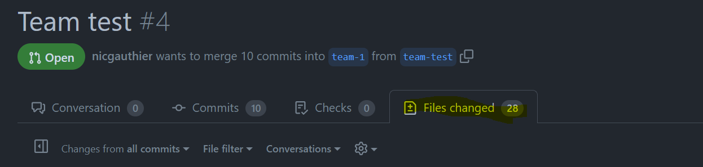
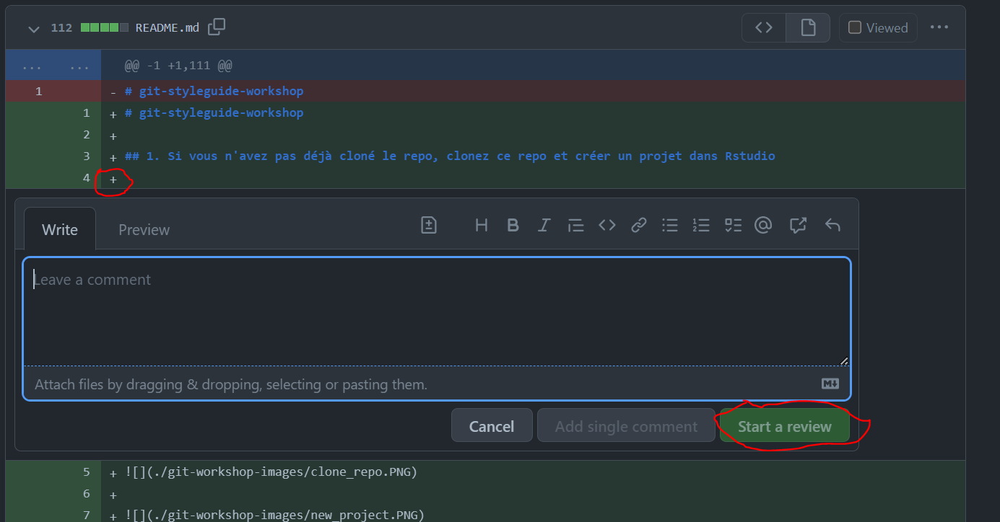
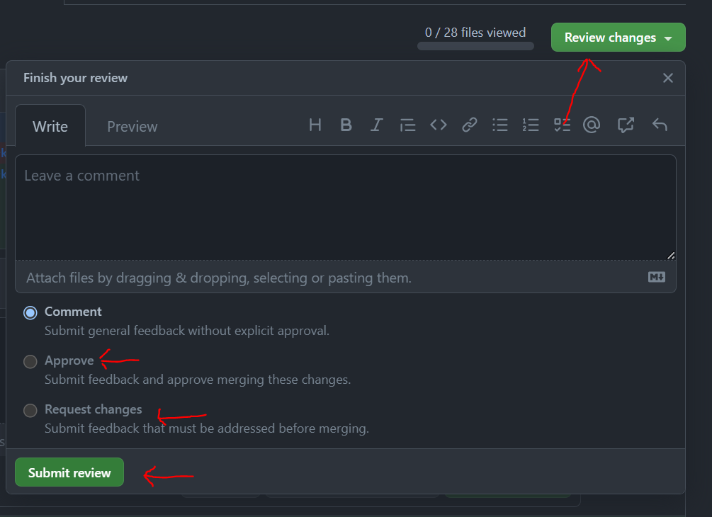

# git-styleguide-workshop

Cette branche s'adresse aux ambassadeurs qui joue le rôle d'arbitre.

## Rôle

Votre rôle est de s'assurer que les joueurs respectent l'esprit du jeu et d'offrir de l'aide lorsque vous le jugez necessaire. Il n'y a pas de limite à l'aide que vous pouvez offrir, nous avons confiance en votre jugement.

## Actions lors du jeu

Lorsque le premier joueur s'executera, le fichier contenant des segments de code R à corriger sera déjà présent dans la branche assignée à votre équipe. Votre première action arrivera donc lorsque le joueur va soumettre sa pull request. À ce moment là vous serez appelé à faire une "review" pour vérifier si tous les erreurs de style guide ont bien été corrigés.

Pour faire une "review", allez dans l'onglet "Files changed" de la Pull request que vous voulez "reviewer"

Pour ajouter des commentaires sur des lignes spécifique du code, pour par exemple indiqué qu'une erreur n'est pas corrigé ou encore pour donner une indices, vous pouvez appuyez sur le "+" à gauche de la ligne

Une fois votre "review" terminée, appuyez sur le bouton "Review changes" pour soit approuver la pull request (si les erreurs ont été corrigées) ou encore demander des changements

Lorsque le joueur aura mergé la PR que vous venez d'approuver, vous devrez ajouter le prochain fichier de 

