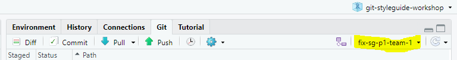

# git-styleguide-workshop

## 1. Si vous n'avez pas déjà cloné le repo, clonez ce repo et créer un projet dans Rstudio

## 2. Si vous avez déjà cloné le repo et que c'est à votre tour de jouer, créer une branche de développement à partir de la branche assignée à votre équipe.

Selectionnez la branche assignée à votre équipe. Vous pouvez soit la choisir dans la liste déroulante ou encore écrire le nom de la branche pour ensuite la selectionner. Si vous ne voyez pas votre branche dans la liste de branche appuyer sur "View all branches" tout au bas de la liste déroulante

Dans la zone de texte inscrivez le nom de la branche que vous voulez créer

**ATTENTION** : le nom de votre branche ne doit pas être le même qu'une branche qui existe déjà, vous devez donc vous assurer d'avoir un nom unique mais qui indique tout de même de facon claire les changements que vous allez faire!

## 3. "pullez"" pour obtenir les changements les plus récents ainsi que la nouvelle branche de developpement que vous venez de créer

## 4. Assurez vous d'être dans la branche que vous venez de créer

## 5. Ouvrez le fichier de code avec des erreurs de style guide le plus récemment ajouté et corrigez les erreurs de styleguide. Il se nomme sg_i, où i est le numéro du tour auquel vous êtes rendu (exemple sg_1, sg_2 etc)

**NB** : On ne s'attend pas à ce que le code roule , la majorité du code dans les fichiers fait références à des objets qui ne sont pas présents dans votre environnement. On s'intéresse uniquement à la syntaxe de style

## 6. Lorsque vous pensez avoir corrigé les erreurs de styleguide, "commitez" et "pushez" vos modifications

Assurez vous de sauvegarder votre fichier

Cochez le fichier que vous voulez "commiter"

Ouvrez la fenêtre de "Commit"

Ajoutez une description brève mais claire des changements que vous venez de faire

Appuyez sur commit

"Pushez"

## 7. Vous voulez maintenant créer une pull request pour merger les changements que vous venez de faire dans la branche assignée à votre équipe

Dans Github cliquer sur l'onglet de pull request

Créez une nouvelle PR

Selectionnez la branche dans laquelle vous voulez "merger" vos changements, soit là branche assignée à votre équipe

Selectionnez la branche que vous voulez "merger"

Assurez vous que les changements correspondent bien à ce que vous avez fait et créer votre pull request

Ajoutez votre arbitre comme reviewer de votre pull request et créez la pull request

## 8. Si votre arbitre approuve votre pull request c'est que vous avez correctement corrigé les erreurs de styleguide!

Si ce n'est pas le cas, votre arbitre ajoutera des demandes de changements à certaines lignes du fichier pour vous orientez dans vos recherches.

Si vous ne trouvez vraiment pas, en dernier recours l'arbitre est autorisé à vous donner des indices pour vous permettre de progresser.

## 9. Lorsque votre branche de développement a été mergée, il est bon de prendre l'habitude d'effacer sa branche

## 10. Votre arbitre vous donnera le nom de la branche à merger pour obtenir des lignes qui vous permettront de progresser dans la complétion de votre image.

Avec vos nouvelles connaissances mergez la branche mentionnée par l'arbitre dans la branche assignée à votre équipe (il n'est pas necessaire d'ajouter un reviewer cette fois-ci)

Si votre github vous indique "Can't automatically merge" comme dans l'image ci dessous. C'est que vous avez un merge conflict, créer tout de même la pull resquest comme d'habitude.

Si vous avez un merge conflict, voici les instructions pour arriver à merger votre branche. **Si vous n'avez pas de merge conflict vous pouvez merger normalement et passer à la prochaine étape (11)**.

Un conflit survient lorsque le code que vous tentez de modifier a déjà été modifier par quelqu'un d'autre avant vous. Github ne veut pas assumer quelles lignes de code sont les bonnes, il vous demande donc de le faire pour lui.

Une fois la PR créee, pour régler votre merge conflict appuyer sur "resolve conflitcs"

Github va ouvrir un éditeur pour vous permettre de régler votre merge conflict. Comme dans l'image ci-dessous vous devriez voir 2 blocs de code délimité par des \<\<\<\<\<\< , ======= et \>\>\>\>\>\>\> qui vous permettent de voir le code qui vient de votre branche et de la branche que vous tentez de merger. Effacer les lignes que vous ne voulez pas garder ainsi que les délimiteurs et appuyer sur mark as resolve

ensuite appuyer sur commit merge

Vous devriez maintenant être en mesure de merger votre branche normalement!

## 11. (Optionnel) Si 4 membres de votre équipe ont complété les étapes 1 à 10 autrement continuer cette étape, autrement allez directement à l'étape 12.

Votre arbitre vous autorisera à modifier le fichier "image.txt" d'une autre équipe. Cela ralentira leur progression en causant un "merge conflict" lorsqu'ils tenteront de faire progresser leur image.

Dans github aller dans la branche de l'équipe à qui vous souhaiter nuire et cliquer sur le fichier nommer image.txt

Appuyer sur l'icon de crayon pour modifier le fichier

à la fin du document ajouter une ligne avec le nom de votre équipe

Tout en bas de la page web ajoutez un commentaire de commit et "commitez" vos changements

## 12.L'arbitre ajoutera un nouveau fichier de lignes de code qui ne respectent pas le styleguide à votre branche et le joueur suivant doit simplement répéter les étapes 1 à 11 à son tour!

# Have fun!
